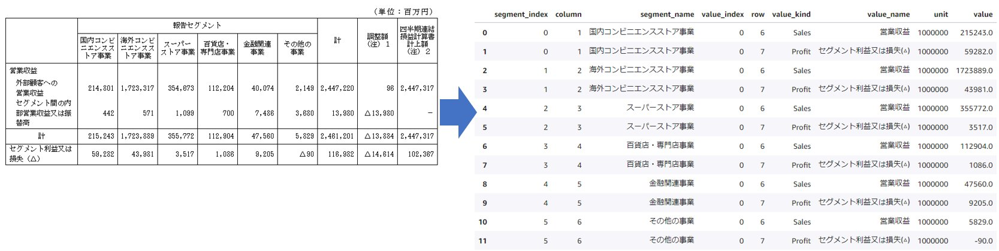

# 決算短信セグメント情報のデータ抽出ハンズオン

HTML 化された決算短信から、セグメント情報を抽出する方法が学べるハンズオンです。

HTML 化された決算短信は、[適時開示情報閲覧サービス](https://www.release.tdnet.info/inbs/I_main_00.html)か、[東証上場会社情報サービス](https://www.jpx.co.jp/listing/co-search/index.html)から取得できます。データを取得し、セグメント情報を抽出する方法はハンズオン資料を参照してください。

## ハンズオンコンテンツ

1. HTML から情報を抽出する方法を学ぶ 
   * HTML とは
   * Python による HTML からの情報抽出
   * Exercise1: 目的の HTML 要素を検索する
   * Exercise2: 目的の HTML 要素へ移動する
2. HTML 化された決算短信からセグメント情報を抽出する方法を学ぶ  
   * HTML 化された決算短信とは
   * Exercies1: 決算短信 HTML ファイルからセグメント情報を抽出する
   * Exercies2: セグメント情報の抽出が失敗する理由を分析する

※2番目のコンテンツ Exercise2 が示すように、本ハンズオンはあらゆる企業の HTML からセグメント情報が抽出できるプログラムを提供するものではありません。抽出が失敗する理由を理解し、修正箇所を特定できる技能を身に着けることを目的としています。

## ハンズオンの進め方

Amazon SageMaker Studio Lab を使用し簡単に始めることができます。ハンズオンのはじめ方は、 [ハンズオンの進め方](docs/README_usage.md)を参照してください。 
