# 決算短信セグメント情報のデータ抽出ハンズオンの進め方

ハンズオンの進め方を解説します。

1. アカウントを作成する
2. ログインする
3. Jupyter Labを起動する
4. 教材を開く

手順の質問をするときは、手順の番号を伝えてください。(例: 1番のアカウント作成の手順3番目のapprovedのメールが届かない・・・など)。

## 1. アカウントを作成する

SageMaker Studio Labのアカウントを持っていない場合は、アカウントを作成してください。

1. [アカウント作成フォーム](https://bit.ly/3kIjuZL)からアカウントの申し込みを行う。
   * **リファラルコードが提供されている場合、アカウント作成フォームで忘れずに入力ください。**
   * 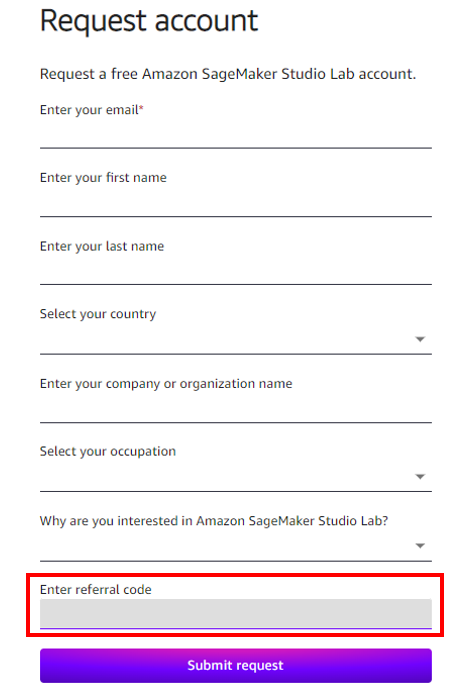
2. `Account request confirmed ...`のメールを受信する。
   * アカウントの申し込みが受け付けられた連絡です。リクエストの受付はすぐにメールが届きます。
3. `Account request approved ...`のメールを受信し、メール内のリンクからアカウントを作成する。
   * 申し込みが承認された連絡です。メール内のリンクからアカウント作成を行ってください。
   * 承認は 5 営業日以内に結果が通知されます。リファラルコードを利用している場合は 2~3 分以内に結果が届きます。
4. `Verify your email ...`のメールを受信し、メール内のリンクからメールアドレスを認証する。
   * アカウント作成後にメールアドレスの認証を行います。メール内のリンクからメールアドレスを認証してください。
5. `Your account is ready ...`のメールを受信する。
   * お待たせしました！利用開始いただけます。

## 2. ログインする

Studio Labへのログインは、[Studio Lab のランディングページ](https://studiolab.sagemaker.aws/)から行います。ブラウザは、次のように本手順書とSageMaker Studio Labを並べて見られるようにしてください。

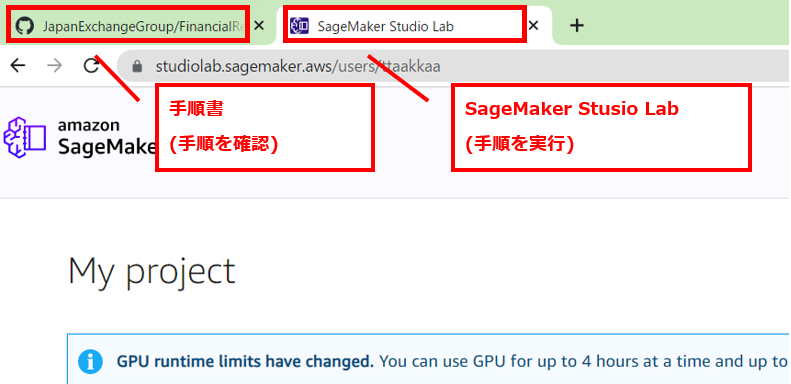

1. 右上の "Sign in" ボタンを押す。
   * 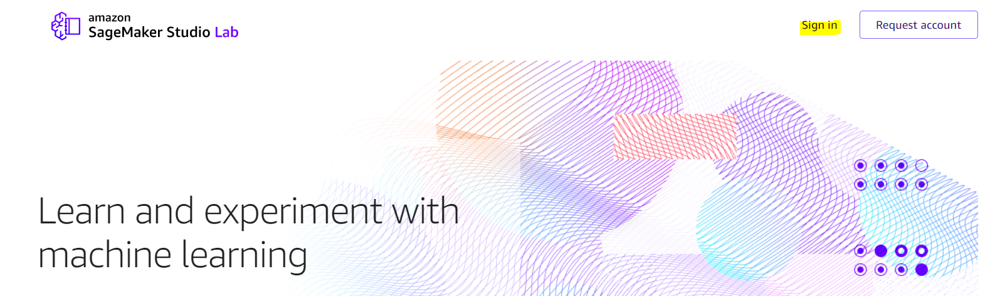
2. Eメールアドレス/ユーザー名、パスワードを入力する。
3. "Sign in" を押しプロジェクトのページを開く。
   * 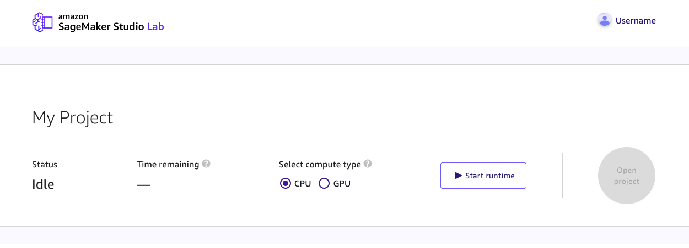

## 3. Jupyter Labを起動する

Studio LabではCPU/GPUのいずれかでJupyter Notebookを実行することができます。CPUは12時間/セッション、GPUは4時間/セッションです。GPUは24時間以内8時間までという制約があります。

1. 「My Project」の「Select compute type」から CPUを選択する。
2. 「Start runtime」を押す。
   * 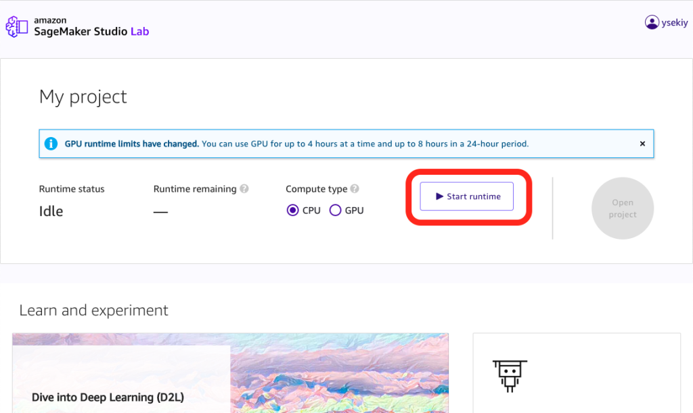
   * 起動時に“There is no runtime available right now.”と表示された場合は何回かボタンを押してみてください。
3. ランタイムが開始したら「Open project」を押す。
   * JupyterLab 環境が起動します。

## 4. 教材を開く

ハンズオンの教材を、Studio Labにコピーします。

1. 左サイドバーのメニューを選択し、「Clone a Repository」を選択する。
   *  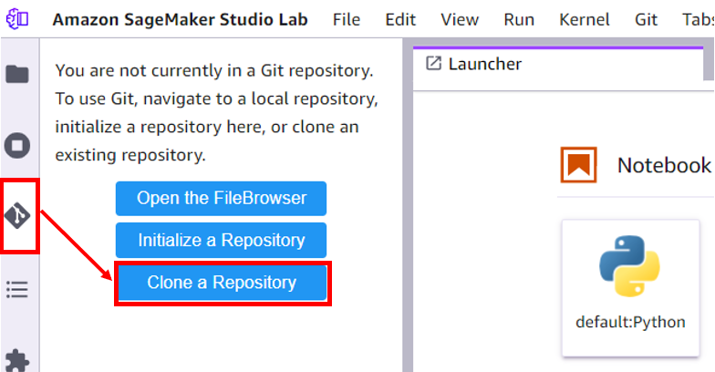
2. GitHubから教材のファイルをコピーする。
   * 「Git repository URL (.git)」に次のURLを入れて「Clone」を押してください。
   * `https://github.com/JapanExchangeGroup/FinancialResultsHTML-DataExtraction.git`
   *  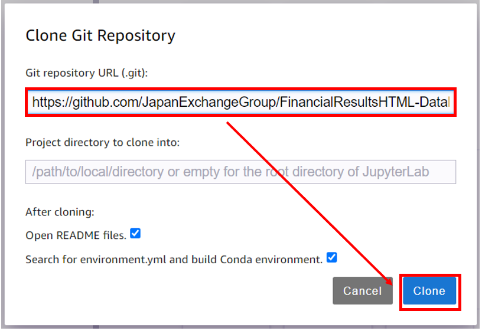
3. "Confirm you want to build..."が出たら「OK」を押す。
   * リポジトリに含まれている `environment.yml` から自動的環境を作成してくれます。
   * 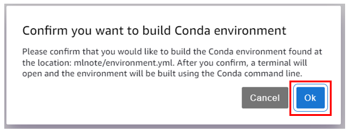
   * OKを押し忘れたら`environment.yml`を右クリックし「Build Conda Environment」を実行してください。
   * 起動したターミナルで実行されたコマンドが終了したら環境構築は完了です。「done」とコンソール上に表示されます。
   * 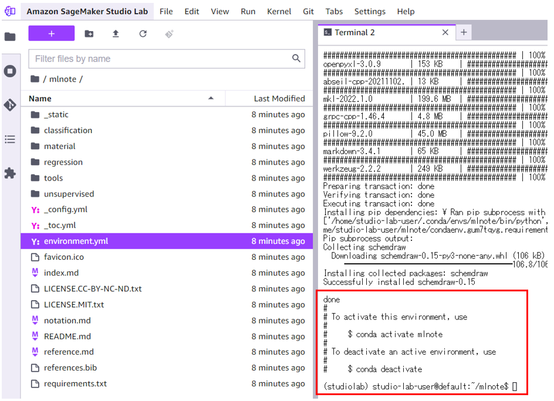
4. 教材である `FinancialResultsHTML-DataExtraction/notebooks/01_how_to_extract_from_html.ipynb` を開く。
   * 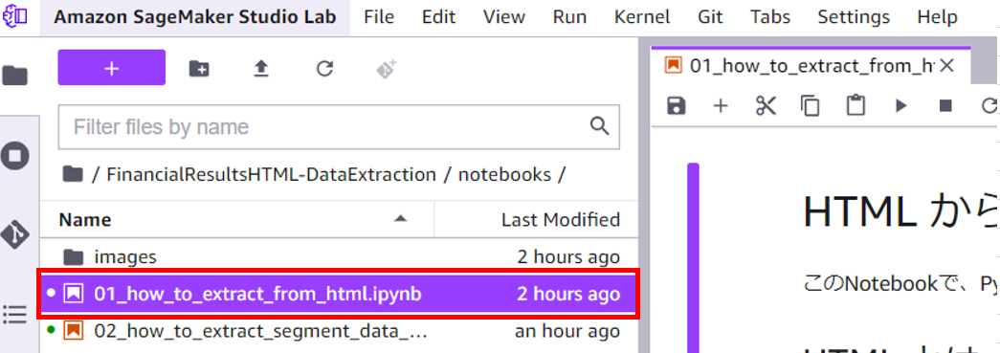
5. 教材のNotebookを動かすためのKernelを選択する。
   * 右上の 「No Kernel」を押し、 `jpx-frde`を選択。
   * 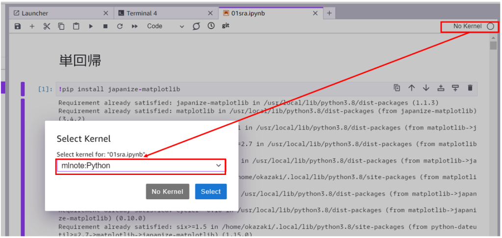
6. お疲れさまでした！以後はNotebookに書かれている手順に沿って進めてください。

## 参考資料

* [公式ドキュメント](https://docs.aws.amazon.com/sagemaker/latest/dg/studio-lab.html)
* [公式FAQ](https://studiolab.sagemaker.aws/faq)
* [Studio Lab日本コミュニティQA](https://github.com/aws-sagemaker-jp/awesome-studio-lab-jp/discussions)
   * 使い方に関する質問があればこちらのDiscussionに投稿をお願いします！
